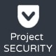

# Project SECURITY - Website Security, Antivirus & Firewall



## Overview

Project SECURITY is a comprehensive website security solution designed to protect your website from a wide range of threats, including hackers, attacks, and vulnerabilities. It acts as a robust shield, safeguarding your online presence from SQL injection (SQLi) attacks, cross-site scripting (XSS) vulnerabilities, proxy visitors, spammers, and various other malicious activities.

This application employs intelligent algorithms, similar to those used by leading industry companies, to detect both known hacker attacks and emerging, unknown threats. By utilizing code recognition and pattern analysis, Project SECURITY proactively identifies and neutralizes potential risks, ensuring the continuous security of your website.

## Key Features

- **Real-time Threat Detection:** Employs advanced algorithms to identify and block malicious requests in real-time.
- **Proactive Protection:** Protects against SQLi, XSS, proxy visitors, spammers, and other threats.
- **Admin Panel:** Provides a user-friendly interface for managing security settings and monitoring website activity.
- **Ban System:** Allows you to block and redirect suspicious visitors based on IP address, country, IP range, operating system, browser, ISP, and referrer.
- **Detailed Logging:** Records all detected threats and attacks, providing valuable insights into security incidents.

## Core Modules

- **SQLi Protection:** Prevents SQL injection attacks by sanitizing user inputs and blocking malicious queries.
- **XSS Protection:** Mitigates cross-site scripting vulnerabilities by encoding and filtering user-generated content.
- **Proxy Protection:** Blocks visitors using proxies, VPNs, and Tor to hide their identity.
- **Spam Protection:** Filters out spammers and spam bots that attempt to flood your website with unwanted content.
- **Input Sanitization:** Automatically sanitizes all incoming and outgoing requests and responses to prevent malicious code injection.
- **Bad Words Filtering:** Filters profanity, bad words, bad links, and other inappropriate content in real-time.
- **DNSBL Integration:** Integrates with leading DNSBLs to identify and block known malicious IP addresses.
- **Bad Bots and Crawlers Protection:** Blocks malicious bots and crawlers that consume excessive bandwidth and resources.
- **Fake Bots Protection:** Verifies search engine bots to ensure they are legitimate and not impersonating real bots.
- **Headers Check:** Analyzes HTTP headers for suspicious patterns and blocks requests with malicious headers.

## Additional Features

- **Auto Ban:** Automatically blocks attackers and threats based on predefined rules.
- **IP Lookup:** Allows you to investigate IP addresses and check if they are blacklisted.
- **E-Mail Notifications:** Sends email notifications when attacks or threats are detected.
- **Dashboard with Stats:** Provides a visual overview of your website's security status.
- **.htaccess Editor:** Allows you to edit your .htaccess file directly from the admin panel.
- **IP & File Whitelist:** Allows you to exclude specific IP addresses and files from security checks.
- **Live Traffic:** Monitors website traffic in real-time.
- **Visit Analytics:** Tracks and analyzes website visitor behavior.
- **PHP Configuration Checker:** Identifies potential security flaws in your PHP configuration.
- **System Information:** Provides detailed information about your web hosting environment.

## Requirements

- PHP 5.6 or higher
- MySQL 5.0 or higher

## Installation

1.  Create a subfolder named `security` under your website's root directory (e.g., `www` or `public_html`).
2.  Upload the files from the `Source` folder to the newly created `security` directory.
3.  Set CHMod 777 permissions to the `security` folder and all its subfolders and files.
4.  Create a MySQL database.
5.  Visit your website's security directory (e.g., `yourwebsite.com/security`).
6.  Follow the on-screen instructions in the Installation Wizard.
7.  Copy the integration code provided at the end of the installation process.
8.  Paste the integration code into the main PHP file of your website (e.g., `index.php`, `config.php`, or a core file included in all other PHP files).

    ```php
    include "security/config.php";
    include "security/project-security.php";
    ```

## Update Instructions

-   To update the script, replace all files except `config_settings.php`.
-   If you encounter issues, delete the `config.php` file and repeat the installation steps.
-   Back up your data by exporting all Project SECURITY-related database tables.

### v4.8 Update

Run the following SQL queries in phpMyAdmin:

```sql
ALTER TABLE `psec_bans` CHANGE `ip` `ip` CHAR(45) CHARACTER SET utf8mb4 COLLATE utf8mb4_unicode_ci NOT NULL;
ALTER TABLE `psec_bans-ranges` CHANGE `ip_range` `ip_range` CHAR(19) CHARACTER SET utf8mb4 COLLATE utf8mb4_unicode_ci NOT NULL;
ALTER TABLE `psec_ip-whitelist` CHANGE `ip` `ip` CHAR(45) CHARACTER SET utf8mb4 COLLATE utf8mb4_unicode_ci NOT NULL;
ALTER TABLE `psec_live-traffic` CHANGE `ip` `ip` CHAR(45) CHARACTER SET utf8mb4 COLLATE utf8mb4_unicode_ci NOT NULL;
ALTER TABLE `psec_logs` CHANGE `ip` `ip` CHAR(45) CHARACTER SET utf8mb4 COLLATE utf8mb4_unicode_ci NOT NULL;
ALTER TABLE `psec_logins` CHANGE `ip` `ip` CHAR(45) CHARACTER SET utf8mb4 COLLATE utf8mb4_unicode_ci NOT NULL;
```

### v5.0.6 Update

If you are using SpamHaus DNSBLs in the SPAM Protection Module, switch to a different active DNSBL (e.g., `bl.spamcop.net`).

## Sources and Credits

-   **Font Awesome Icons:** [FontAwesome.com](https://fontawesome.com)
-   **Bootstrap Framework:** [GetBootstrap.com](https://getbootstrap.com)
-   **DataTables:** [DataTables.net](https://datatables.net)
-   **jQuery:** [jQuery.com/](https://jquery.com/)
-   **AdminLTE:** [github.com/almasaeed2010/AdminLTE](https://github.com/almasaeed2010/AdminLTE)
-   **Select2:** [select2.github.io](https://select2.github.io)
-   **OpenLayers:** [github.com/openlayers/openlayers](https://github.com/openlayers/openlayers)
-   **Chart.js:** [Chartjs.org](https://www.chartjs.org/)
-   **Flag Sprites:** [Flag-Sprites.com](https://www.flag-sprites.com)
-   **iP.NF:** [ip.nf](https://ip.nf)
-   **ipapi.co:** [ipapi.co/](https://ipapi.co/)
-   **IPHub:** [iphub.info](https://iphub.info)
-   **proxycheck.io:** [proxycheck.io](https://proxycheck.io)
-   **IPHunter:** [iphunter.info](https://www.iphunter.info)
-   **Switchery:** [abpetkov.github.io/switchery](https://abpetkov.github.io/switchery)
-   **Popper.JS:** [popper.js.org](https://popper.js.org)
-   **OverlayScrollbars:** [github.com/KingSora/OverlayScrollbars](https://github.com/KingSora/OverlayScrollbars)

## Developed By

Ray Daniel

---

&copy; 2025 Project SECURITY. All rights reserved.